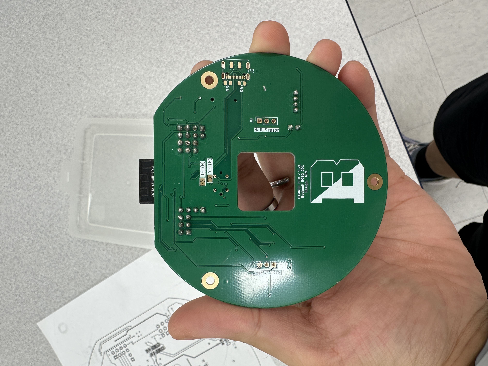

# DAMNED — sophomore-year hardware project

**Digital Analog Modular NeoPixel Enabled Display** is an extensible IoT platform used in Bucknell's ECEG 201 coursework. The photos below show populated physical hardware.

**Design credit:** the base PCB is marked “Design: MPL,” and the supplied course documentation credits Matt Lamparter for the system block diagram. This page presents the course platform and project materials without claiming that I independently designed the complete base board.

## Hardware

The platform combines an ESP32-S3 controller, sensor expansion connections, a NeoPixel ring interface, and a stepper-motor drive circuit. The supplied schematic includes a PCA9685 and TB6612FNG, along with a Hall-sensor connection for position feedback.

## An elegant feature of the course platform

**A PWM controller and motor driver share the work.** The PCA9685 supplies control signals to the TB6612FNG motor driver through an I²C-controlled interface. This separates the microcontroller's high-level commands from motor-drive outputs and leaves the controller available for sensors, networking, and display updates. This is a feature of the credited course design, not a claim of my original invention.

[Open the course PCB schematic (SVG)](schematics/DAMNED.svg).

## Application explored

My supplied project report describes a **Dorm Plant Health Monitor** using a capacitive soil-moisture sensor and a BH1750 light sensor on the I²C bus. The proposed display maps moisture to the LED ring and motor pointer so plant conditions can be read at a glance. The supplied materials do not establish a completed, tested implementation of that application, so no such result is claimed here.

The photographs demonstrate physical assembly; they do not by themselves verify electrical operation. The exact scope of my PCB modifications, assembly, firmware, and testing contributions should be confirmed before this page is used as an application submission.
