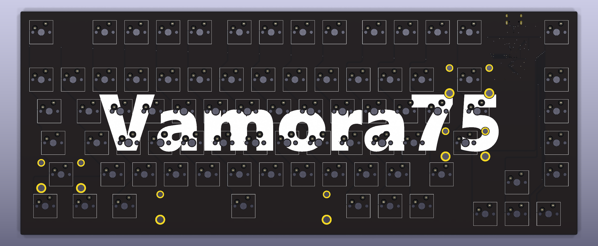
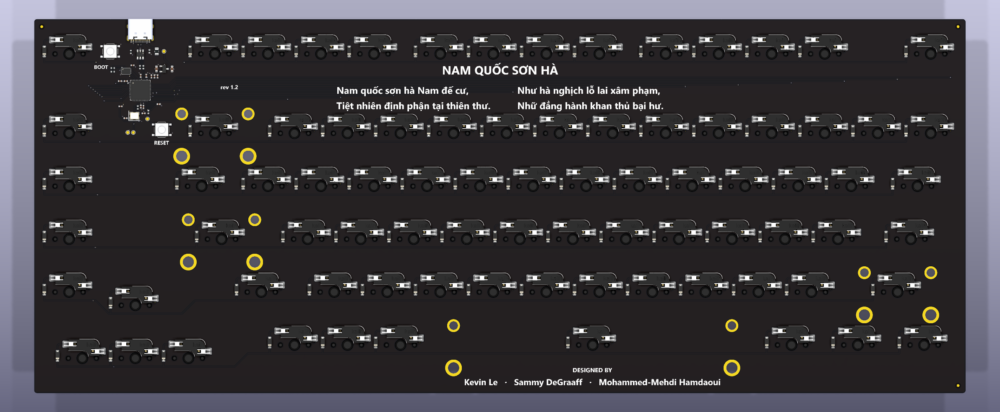
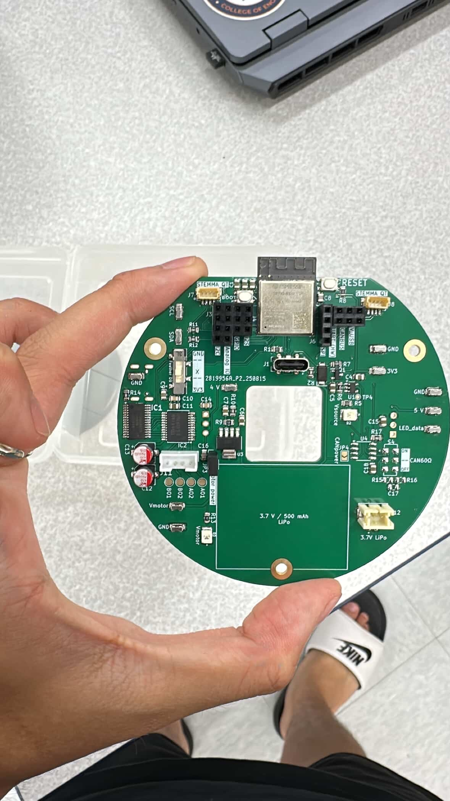

# Minh Toan Le — Electrical Engineering Projects

[LinkedIn](https://www.linkedin.com/in/toan-kevin-le-66587b327/) · [Email](mailto:kevintoanle1205@gmail.com)

Two projects spanning PCB design and physical hardware. Start with **Vamora75** for the PCB design showcase; **DAMNED** provides context from my sophomore-year coursework.

| Project | Status | What to look at |
| --- | --- | --- |
| [Vamora75 — 75% mechanical keyboard](Vamora75/) | Circuit/PCB designed and rendered; **not manufactured or physically tested** | An on-board RP2040 and hot-swap sockets, with all SMT components on the bottom side |
| [DAMNED — modular IoT display](DAMNED/) | Populated hardware photographed; sophomore-year class project | A modular ESP32-S3 platform combining a motor-driven pointer, RGB LEDs, and sensor interfaces |

## Vamora75 preview

**A useful design detail:** keeping the controller, supporting circuitry, diodes, and hot-swap sockets on the same side of the PCB consolidates SMT placement onto one face. Integrating the RP2040 also avoids a separate controller daughterboard and its header stack. [See the design and schematic →](Vamora75/)

## DAMNED preview

The base PCB is course hardware, marked **“Design: MPL”** on its underside. It is presented with that credit, without claiming sole authorship of the board. [See hardware photos and schematic →](DAMNED/)
