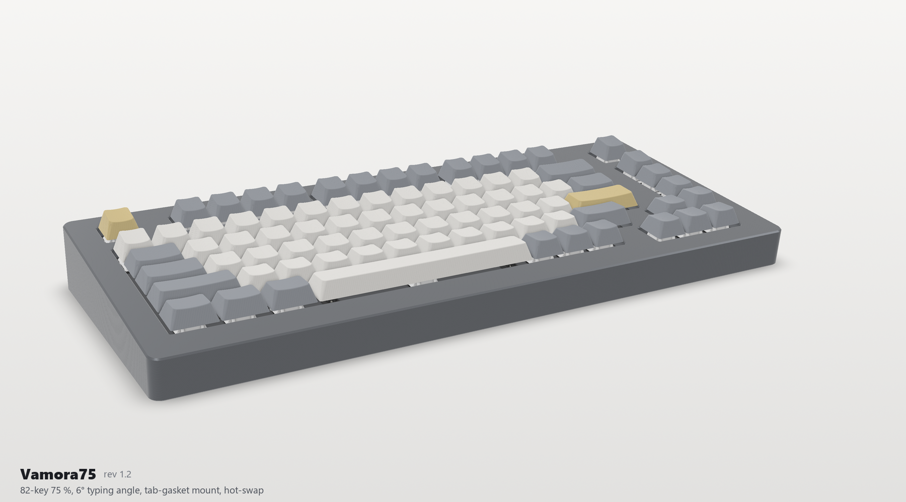

# Vamora75 — 75% mechanical keyboard

**Status: designed and rendered, not manufactured.** These images are CAD renders. Electrical bring-up, USB operation, switch scanning, and physical fit remain to be verified on a prototype.

The project credits Kevin Le (Minh Toan Le), Sammy DeGraaff, and Mohammed-Mehdi Hamdaoui. It combines an 82-key layout with an on-board RP2040, USB-C, a diode-per-key 6 × 16 matrix, and Kailh hot-swap sockets on a two-layer PCB.

## The detail worth a closer look

**Put the electronics and hot-swap sockets on one assembly face.** All SMT parts sit on the bottom of the PCB, including the RP2040, flash, power circuitry, key diodes, and sockets. This makes the assembly plan simpler by avoiding SMT placement on both faces. The integrated controller also removes the need for a controller module mounted on headers beneath the board.

The tradeoff is that the bare RP2040 needs its own power, clock, flash, and USB support circuitry. The design includes a 12 MHz crystal, 2 MB flash, USB ESD protection, a 0.5 A resettable fuse, and BOOT/RESET buttons. The controller core follows Raspberry Pi's reference design; the project does not claim that circuit as an original invention.

## Schematic and next checks

[Open the full schematic (SVG)](schematics/Vamora75.svg). Zoom in to inspect the controller, power input, USB, and matrix wiring.

The supplied project's validation report records clean ERC/DRC and schematic-to-PCB parity checks. Those are software checks, not evidence of a working board. First-prototype work includes checking power rails and shorts, verifying USB enumeration and all keys, compiling/testing firmware, and checking socket orientation and mechanical clearances.

## Credits

See [the original attribution](ATTRIBUTION.md) and [license notices](Licenses/). These preserve the team and third-party credits, including ScottoKicad footprints/models and the Raspberry Pi controller reference circuit. This folder is a curated showcase, not the complete manufacturing/source package referenced by the original attribution.
